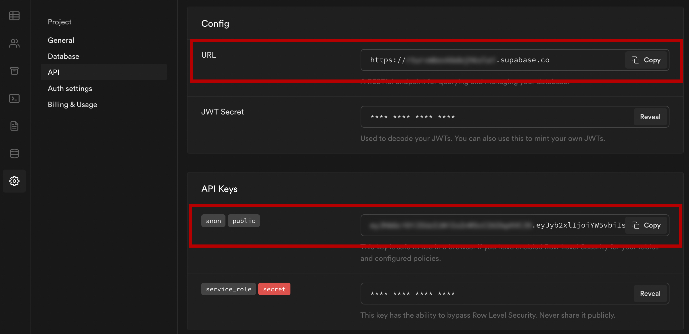

## Full stack blog with Supabase and Next.js

This code goes along with the blog post __The Complete Guide to Full Stack Development with Supabase and Next.js__ published [here](https://www.freecodecamp.org/news/the-complete-guide-to-full-stack-development-with-supabas/)

To get started with this project, follow these steps.

1. Create a new project in the [Supabase](https://supabase.io/) dashboard

2. Click on __SQL__ in the left menu, and execute the following SQL query:

```sql
CREATE TABLE posts (
  id bigint generated by default as identity primary key,
  user_id uuid references auth.users not null,
  user_email text,
  title text,
  content text,
  inserted_at timestamp with time zone default timezone('utc'::text, now()) not null
);

alter table posts enable row level security;

create policy "Individuals can create posts." on posts for
    insert with check (auth.uid() = user_id);

create policy "Individuals can update their own posts." on posts for
    update using (auth.uid() = user_id);

create policy "Individuals can delete their own posts." on posts for
    delete using (auth.uid() = user_id);

create policy "Posts are public." on posts for
    select using ( true );
```

## Run either locally or deploy to Vercel

### Deploying to Vercel

[](https://vercel.com/new/git/external?repository-url=https%3A%2F%2Fgithub.com%2Fdabit3%2Fsupabase-next.js&env=NEXT_PUBLIC_SUPABASE_URL,NEXT_PUBLIC_SUPABASE_ANON_KEY&envDescription=API%20URL%20and%20API%20Key)

### Running locally

1. Clone this project

```sh
git clone https://github.com/dabit3/supabase-next.js.git
```

2. Change into the directory and install the dependencies

```sh
cd supabase-next

npm install
```

3. Create a file named __.env.local__ and update it with the values from your Supabase project:

```
NEXT_PUBLIC_SUPABASE_URL=https://app-id.supabase.co
NEXT_PUBLIC_SUPABASE_ANON_KEY=your-public-api-key
```



4. Run the server

```sh
npm run dev
```
